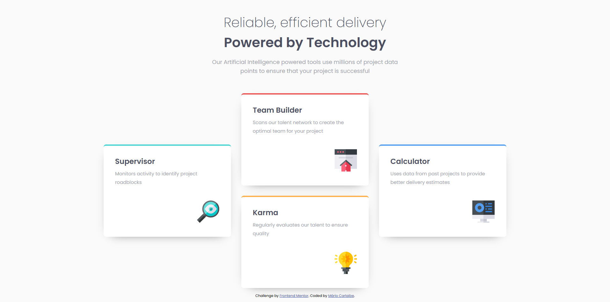
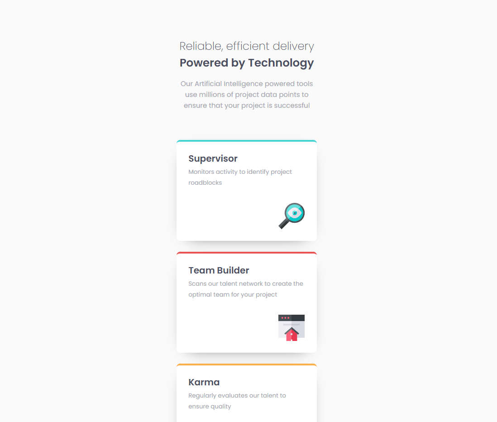

# Frontend Mentor - Solução de seção de recursos de quatro cartas

Esta é uma solução para o [Desafio de seção de recursos de quatro cartas no Frontend Mentor](https://www.frontendmentor.io/challenges/four-card-feature-section-weK1eFYK). Os desafios do Frontend Mentor ajudam você a melhorar suas habilidades de codificação construindo projetos realistas.

## Índice

- [Visão geral](#visão-geral)
- [O desafio](#o-desafio)
- [Captura de tela](#captura-de-tela)
- [Links](#links)
- [Meu processo](#meu-processo)
- [Construído com](#construído-com)
- [O que aprendi](#o-que-aprendi)
- [Desenvolvimento contínuo](#desenvolvimento-continuo)
- [Recursos úteis](#recursos-úteis)
- [Autor](#autor)
- [Agradecimentos](#agradecimentos)

## Visão geral

### O desafio

Os usuários devem ser capazes de:

- Visualizar o layout ideal para o site, dependendo do tamanho da tela do dispositivo

### Captura de tela

### Links

- URL da solução: [Adicione a URL da solução aqui](https://your-solution-url.com)
- URL do site ativo: [Adicione a URL do site ativo aqui](https://your-live-site-url.com)

## Meu processo

### Criado com

- Marcação HTML5 semântica
- Propriedades personalizadas CSS
- Flexbox
- Grid CSS
- Fluxo de trabalho mobile-first

### O que aprendi

Aprendi que as vezes é melhor começar pelo mobile first. Mas depois tive que usar o display grid, e nessa parte vi que é preciso mais treinamento nesse ponto. Aprendi também que preciso continuar estudando, visto que algumas coisas eu acabo esquecendo pela falta de prática.

### Desenvolvimento contínuo

Preciso continuar a entender que nem sempre vai ficar exatamente igual ao layout fornecido pelo site, mas que não necessáriamente esta errado, esta apenas diferente.

### Recursos úteis

ChatGPT e Meta AI.

## Autor

- Site - [Mário Carlaibe](https://github.com/MarioCarlaibe)
- Mentor de front-end - [@MarioCarlaibe](https://www.frontendmentor.io/profile/MarioCarlaibe)

## Agradecimentos

Agradeço ao DevQuest pelo aprendizado até o momento.